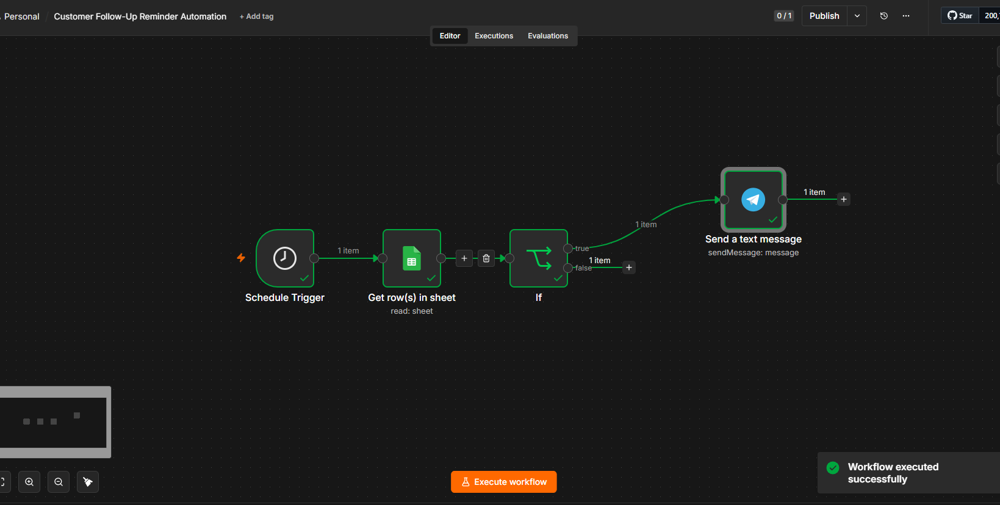
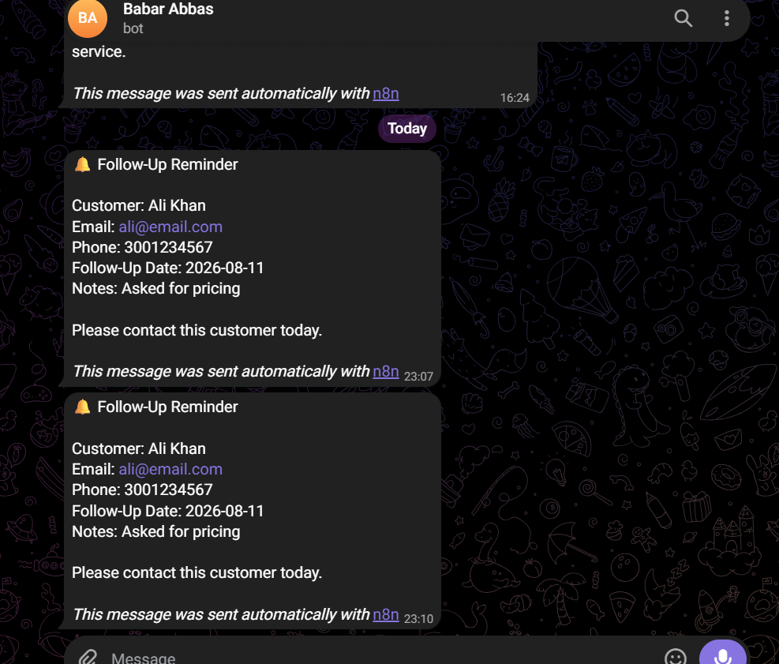
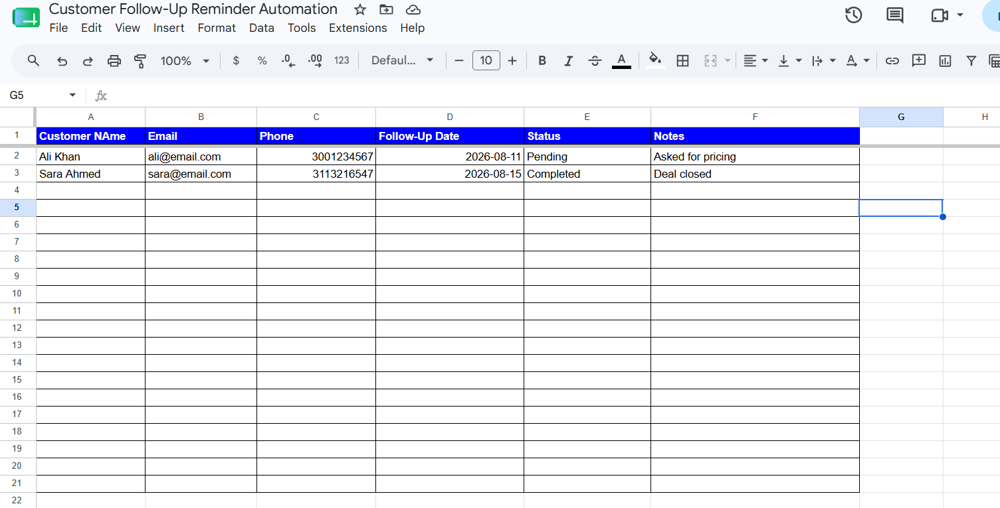

# 📩 Customer Follow-Up Reminder Automation

A simple n8n workflow that automatically checks customer follow-up dates from Google Sheets and sends Telegram reminders to the team when a follow-up is due.

The workflow also ignores customers whose status is `Completed`, preventing unnecessary follow-up notifications.

---

# 📸 Workflow

## n8n Workflow



---

## Telegram Notification



---

## Google Sheets


---

## Completed Customer Test



---

# ✨ Features

- Automatically run the workflow every day
- Read customer records from Google Sheets
- Check customer follow-up dates
- Detect follow-ups due today
- Ignore customers with `Completed` status
- Process multiple customer records
- Send Telegram reminders to the team
- Include customer name, email, phone, follow-up date, and notes
- Prevent unnecessary notifications for completed customers

---

# 🔄 Workflow Steps

1. Schedule Trigger starts the workflow automatically.
2. Google Sheets provides the customer records.
3. The workflow checks the `Follow-Up Date`.
4. The workflow checks the customer's `Status`.
5. Customers with today's follow-up date and a status other than `Completed` continue.
6. Matching customers receive a formatted Telegram reminder.
7. Customers that do not meet the conditions are stopped without sending a notification.

---

# 🛠 Technologies Used

- n8n
- Google Sheets
- Telegram

---

# 📁 Project Structure

```text
.
├── README.md
└── screenshots
    ├── n8n-workflow.png
    ├── telegram-notification.png
    ├── google-sheet.png
    └── completed-status-test.png

    # 🚀 Getting Started

This project is presented as a portfolio demonstration.

The complete working n8n workflow JSON is kept private and is available upon request.

To recreate or deploy the automation, the workflow can be configured using:

- n8n
- Google Sheets
- Telegram Bot

---

# 💡 Use Cases

- Customer Follow-Up Automation
- Sales Follow-Up Reminders
- Lead Follow-Up Management
- CRM Follow-Up Automation
- Customer Relationship Management
- Team Notifications
- Sales Operations

---

# 🔐 Workflow Source

The complete working n8n workflow JSON is kept private to protect the reusable workflow implementation.

**Workflow JSON:** Available upon request.

---

# 📜 License

This project is presented for portfolio and demonstration purposes.

⭐ If you found this project useful, consider giving it a star on GitHub.
